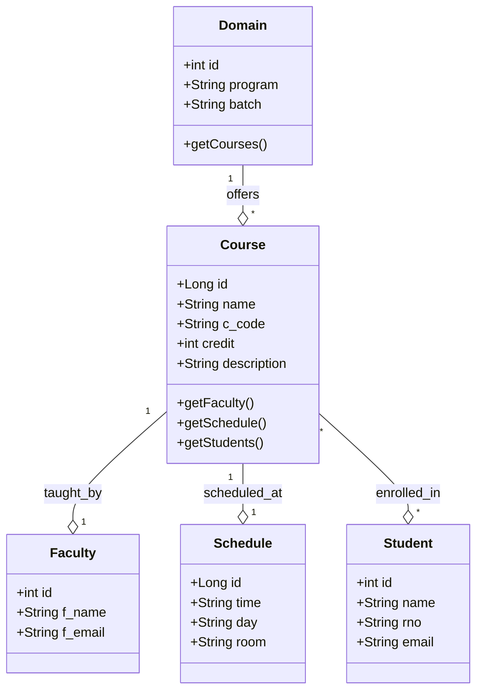
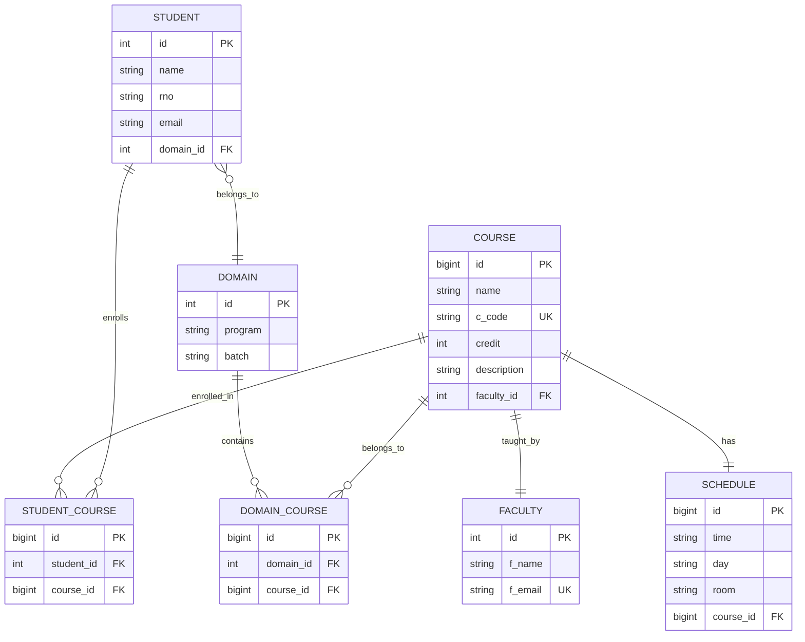

# Database Design for Course TimeTable Module

## 1. Conceptual Design (Class Diagram)

### Entities for Course TimeTable Module

The Course TimeTable module involves the following core entities:



### Entity Descriptions

#### Domain
- **Purpose**: Represents academic programs (MTech CSE, IMTech ECE, etc.)
- **Attributes**:
  - `id`: Primary key
  - `program`: Program name (e.g., "MTech CSE")
  - `batch`: Year of admission (e.g., "2025")

#### Course
- **Purpose**: Represents individual courses offered
- **Attributes**:
  - `id`: Primary key
  - `name`: Course name
  - `c_code`: Unique course code
  - `credit`: Credit hours
  - `description`: Course description (optional)

#### Faculty
- **Purpose**: Represents teaching faculty
- **Attributes**:
  - `id`: Primary key
  - `f_name`: Faculty name
  - `f_email`: Faculty email (unique)

#### Schedule
- **Purpose**: Represents course schedule details
- **Attributes**:
  - `id`: Primary key
  - `time`: Class timing (e.g., "09:00 AM")
  - `day`: Day of week
  - `room`: Room/location

#### Student
- **Purpose**: Represents enrolled students
- **Attributes**:
  - `id`: Primary key
  - `name`: Student name
  - `rno`: Roll number
  - `email`: Student email

### Relationships

1. **Domain ↔ Course** (Many-to-Many)
   - A domain can offer multiple courses
   - A course can be offered in multiple domains
   - Junction table: `domain_course`

2. **Course ↔ Faculty** (One-to-One)
   - Each course is taught by one faculty
   - Each faculty entry is associated with one course

3. **Course ↔ Schedule** (One-to-One)
   - Each course has one schedule
   - Each schedule belongs to one course

4. **Course ↔ Student** (Many-to-Many)
   - A course can have multiple students
   - A student can enroll in multiple courses
   - Junction table: `student_course`

## 2. Logical Design (OR Mapping)

### Table: domain
| Column | Type | Constraints |
|--------|------|-------------|
| id | INT | PRIMARY KEY, AUTO_INCREMENT |
| program | VARCHAR(255) | NOT NULL |
| batch | VARCHAR(255) | NOT NULL |

### Table: course
| Column | Type | Constraints |
|--------|------|-------------|
| id | BIGINT | PRIMARY KEY, AUTO_INCREMENT |
| name | VARCHAR(255) | NOT NULL |
| c_code | VARCHAR(255) | NOT NULL, UNIQUE |
| credit | INT | NOT NULL |
| description | VARCHAR(500) | NULL |
| faculty_id | INT | FOREIGN KEY → faculty(id) |

### Table: faculty
| Column | Type | Constraints |
|--------|------|-------------|
| id | INT | PRIMARY KEY, AUTO_INCREMENT |
| f_name | VARCHAR(255) | NOT NULL |
| f_email | VARCHAR(255) | NOT NULL, UNIQUE |

### Table: schedule
| Column | Type | Constraints |
|--------|------|-------------|
| id | BIGINT | PRIMARY KEY, AUTO_INCREMENT |
| time | VARCHAR(50) | NOT NULL |
| day | VARCHAR(50) | NOT NULL |
| room | VARCHAR(50) | NOT NULL |
| course_id | BIGINT | FOREIGN KEY → course(id) |

### Table: student
| Column | Type | Constraints |
|--------|------|-------------|
| id | INT | PRIMARY KEY, AUTO_INCREMENT |
| name | VARCHAR(255) | NOT NULL |
| rno | VARCHAR(50) | NOT NULL |
| email | VARCHAR(255) | NOT NULL |
| domain_id | INT | FOREIGN KEY → domain(id) |

### Table: domain_course (Junction)
| Column | Type | Constraints |
|--------|------|-------------|
| id | BIGINT | PRIMARY KEY, AUTO_INCREMENT |
| domain_id | INT | FOREIGN KEY → domain(id) |
| course_id | BIGINT | FOREIGN KEY → course(id) |

### Table: student_course (Junction)
| Column | Type | Constraints |
|--------|------|-------------|
| id | BIGINT | PRIMARY KEY, AUTO_INCREMENT |
| student_id | INT | FOREIGN KEY → student(id) |
| course_id | BIGINT | FOREIGN KEY → course(id) |

## 3. ER Diagram



## 4. Database Constraints

### Primary Keys
- All tables have auto-incrementing primary keys

### Foreign Keys
- `course.faculty_id` → `faculty.id`
- `schedule.course_id` → `course.id`
- `student.domain_id` → `domain.id`
- `domain_course.domain_id` → `domain.id`
- `domain_course.course_id` → `course.id`
- `student_course.student_id` → `student.id`
- `student_course.course_id` → `course.id`

### Unique Constraints
- `course.c_code` (Unique course code)
- `faculty.f_email` (Unique faculty email)

### Not Null Constraints
- All core attributes are NOT NULL except `course.description`

## 5. Normalization

The database design follows **Third Normal Form (3NF)**:

1. **1NF**: All attributes contain atomic values
2. **2NF**: No partial dependencies (all non-key attributes depend on entire primary key)
3. **3NF**: No transitive dependencies (no non-key attribute depends on another non-key attribute)

## 6. Indexing Strategy

Recommended indexes for performance:

```sql
-- For faster domain lookup
CREATE INDEX idx_domain_program ON domain(program);

-- For faster course code lookup
CREATE INDEX idx_course_code ON course(c_code);

-- For faster faculty email lookup
CREATE INDEX idx_faculty_email ON faculty(f_email);

-- For faster schedule queries
CREATE INDEX idx_schedule_course ON schedule(course_id);

-- For faster student queries
CREATE INDEX idx_student_domain ON student(domain_id);

-- For faster junction table queries
CREATE INDEX idx_domain_course_domain ON domain_course(domain_id);
CREATE INDEX idx_domain_course_course ON domain_course(course_id);
CREATE INDEX idx_student_course_student ON student_course(student_id);
CREATE INDEX idx_student_course_course ON student_course(course_id);
```

## 7. Sample Data Model

### Example: MTech CSE Domain with Courses

```
Domain: MTech CSE (2025)
  ├── Course: Data Structures & Algorithms (CS202)
  │     ├── Faculty: Prof. Sunita Gupta
  │     ├── Schedule: Thursday, 10:00 AM, LH-1
  │     └── Students: [Student1, Student2, ...]
  │
  ├── Course: Introduction to Programming (CS101)
  │     ├── Faculty: Dr. Amit Sharma
  │     ├── Schedule: Monday, 09:00 AM, R-101
  │     └── Students: [Student3, Student4, ...]
  │
  └── Course: Advanced Machine Learning (MT501)
        ├── Faculty: Dr. Vikram Singh
        ├── Schedule: Friday, 03:00 PM, Lab-3
        └── Students: [Student5, Student6, ...]
```
